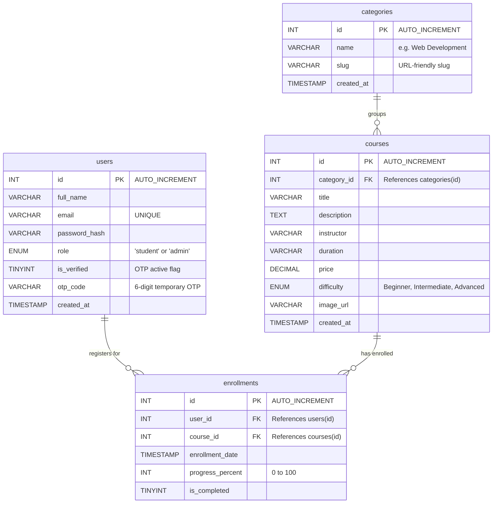

# ApexAcademy E-Learning Portal: ER Diagram & Wireframe Specifications

This document establishes the official database Entity-Relationship (ER) architecture and the page-by-page wireframe design system for the **ApexAcademy E-Learning Portal (Task 5 Capstone Project)**.

---

## 1. Database Entity-Relationship (ER) Diagram

The following Mermaid.js diagram illustrates the relational links, primary keys (`PK`), and foreign keys (`FK`) establishing strict referential integrity across the `apex_academy_db` schema.



---

## 2. Structural Wireframe Specifications

### 2.1 Home Page (`index.php`)
```
+-----------------------------------------------------------------------------+
| [Logo] ApexAcademy    [Home] [Courses]        [Login] [Register] (Navbar)   |
+-----------------------------------------------------------------------------+
|                                                                             |
|    [ HERO SECTION ]                                                         |
|    "Empowering Future Engineers with Elite Technical Education"             |
|    [ Explore Catalog ] [ Join as Student ]                                  |
|                                                                             |
+-----------------------------------------------------------------------------+
|    [ WHY CHOOSE APEX ACADEMY ]                                              |
|    ( Card 1: Expert Mentorship )  ( Card 2: Zero-Reload AJAX Catalog )      |
+-----------------------------------------------------------------------------+
|    [ FEATURED COURSES GRID ]                                                |
|    +--------------------+  +--------------------+  +--------------------+   |
|    | [Img: Web Dev]     |  | [Img: Applied AI]  |  | [Img: Python Data] |   |
|    | Full-Stack Modern  |  | Applied AI & LLMs  |  | Python for Data    |   |
|    | [ Enroll Now ]     |  | [ Enroll Now ]     |  | [ Enroll Now ]     |   |
|    +--------------------+  +--------------------+  +--------------------+   |
+-----------------------------------------------------------------------------+
|    [ FOOTER ] Quick Links | Contact | Privacy | ApexPlanet Software         |
+-----------------------------------------------------------------------------+
```

---

### 2.2 Login & OTP Gateway (`login.php` & `verify_otp.php`)
```
+-----------------------------------------------------------------------------+
| [Logo] ApexAcademy                                     [Return Home]        |
+-----------------------------------------------------------------------------+
|                                                                             |
|         +---------------------------------------------------------+         |
|         |                     WELCOME BACK                        |         |
|         |                                                         |         |
|         |   Email Address:    [_______________________________]   |         |
|         |   Password:         [_______________________________]   |         |
|         |                                                         |         |
|         |   [ LOGIN TO ACCOUNT ]                                  |         |
|         |                                                         |         |
|         |   Don't have an account? [Register Here]                |         |
|         +---------------------------------------------------------+         |
|                                                                             |
+-----------------------------------------------------------------------------+

OTP VERIFICATION WINDOW (`verify_otp.php`):
+-----------------------------------------------------------------------------+
|   We sent a 6-digit OTP to your email address. Enter it below to activate:   |
|   [ _ _ _ _ _ _ ]  [ SUBMIT OTP ]                                           |
|   (Local Development Note: Simulated OTP displays here if mail server fails)|
+-----------------------------------------------------------------------------+
```

---

### 2.3 Student Dashboard (`dashboard.php`)
```
+-----------------------------------------------------------------------------+
| [Logo] ApexAcademy      [Home] [Courses] [Dashboard]       [Logout]         |
+-----------------------------------------------------------------------------+
|  STUDENT WELCOME BANNER                                                     |
|  "Hello, [Student Name]! Here is your active course progress."               |
+-----------------------------------------------------------------------------+
|  MY ENROLLED COURSES:                                                       |
|  +-----------------------------------------------------------------------+  |
|  | [Course Img]  Full-Stack Modern Web Engineering      Instructor: Aryan |  |
|  |               Progress: [=======>             ] 35%   [ Resume Lesson] |  |
|  +-----------------------------------------------------------------------+  |
|  | [Course Img]  Cyber Security & Ethical Hacking      Instructor: Marcus|  |
|  |               Progress: [=====================] 100%  [ Certificate  ] |  |
|  +-----------------------------------------------------------------------+  |
+-----------------------------------------------------------------------------+
```

---

### 2.4 Super Admin Command Center (`admin_dashboard.php`)
```
+-----------------------------------------------------------------------------+
| [Logo] ApexAcademy ADMIN     [Dashboard] [Courses] [Students]     [Logout]  |
+-----------------------------------------------------------------------------+
|  [ METRIC BOXES ]                                                           |
|  ( Total Students: 124 )   ( Active Courses: 6 )   ( Total Revenue: $4,580) |
+-----------------------------------------------------------------------------+
|  [ CHART.JS DATA VISUALIZATION ]                                            |
|  +-----------------------------------+  +--------------------------------+  |
|  |  Course Enrollment Popularity     |  |  Student Verification Status   |  |
|  |        _                          |  |             _____              |  |
|  |      _| |    _                    |  |            /     \             |  |
|  |     | | |___| |                   |  |           | (Pie) |            |  |
|  |     | | | | | | (Bar Chart)       |  |            \_____/ (Doughnut)  |  |
|  +-----------------------------------+  +--------------------------------+  |
+-----------------------------------------------------------------------------+
|  [ QUICK MANAGEMENT ACTIONS ]                                               |
|  [ + Add New Course ]   [ Audit Student Accounts ]   [ Export Database ]    |
+-----------------------------------------------------------------------------+
```
